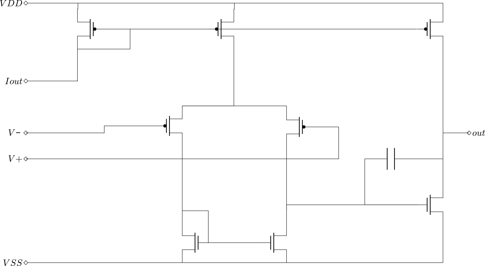

# OTA1336

A Miller transconductance amplifier example.

- doc/     : IP documentation
- dependencies/ : no depenencies

## Documentation Notes

1. Two-stage Miller OTA schematic with PMOS differential pair and bias current source.

[Open PNG directly](./doc/two_stage_miller_ota_pmos.png)

## Symbol and Schematic Conventions

- Enhancement-mode MOSFETs are drawn with a broken channel.
- PMOS devices are shown with a gate bubble, NMOS without a bubble.
- Junction dots are used only for electrical connections; wire crossings avoid ambiguous 4-way joins.
- Schematic flow follows common analog convention: signal left-to-right, VDD at top, VSS/GND at bottom.

Reference material used for these conventions:

- https://en.wikipedia.org/wiki/MOSFET#Circuit_symbols
- https://en.wikipedia.org/wiki/Circuit_diagram#Organization
- https://en.wikipedia.org/wiki/Electronic_symbol#Standards_for_symbols
