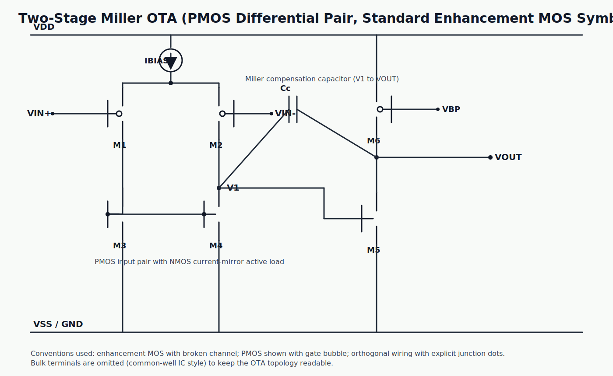

# OTA1336

A Miller transconductance amplifier example.

- doc/     : IP documentation
- dependencies/ : no depenencies

## Documentation Notes

1. Place an SVG image of a two-stage Miller OTA with a PMOS differential pair and bias current source.

   
